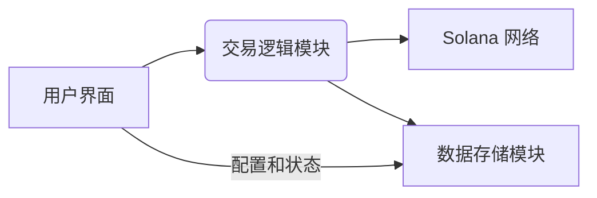

# Solana 自动交易机器人设计文档

**1. 简介**

本设计文档旨在概述一个在 Solana 区块链上运行的自动交易机器人的架构和功能。该机器人允许用户在指定合约地址（CA）的代币上进行自动买入，并设置限价卖出订单。

**2. 功能需求**

*   **自动买入：**
    *   用户输入 Solana 链上代币的合约地址（CA）。
    *   用户设置买入金额（以美元计价）。
    *   机器人监听用户输入的 CA。
    *   一旦接收到 CA，机器人自动执行买入操作，买入价值为用户设定金额的代币。
*   **限价卖出：**
    *   用户可以为已买入的代币设置限价卖出价格。
    *   机器人持续监控市场价格。
    *   当市场价格达到或超过用户设定的卖出价格时，机器人自动执行卖出操作。
*   **用户交互：**
    *   提供清晰的用户界面或命令行界面，供用户输入 CA、买入金额和卖出价格。
    *   显示交易状态和历史记录。
*   **安全性：**
    *   安全地管理用户的私钥和交易签名。
    *   防止未经授权的访问和操作。

**3. 系统架构**

该机器人可以采用以下架构：



*   **用户界面模块：**  负责接收用户输入（CA、买入金额、卖出价格）并展示交易状态。可以使用命令行界面（CLI）或图形用户界面（GUI）。
*   **交易逻辑模块：**  核心模块，负责处理交易逻辑：
    *   监听用户输入的 CA。
    *   获取实时市场价格。
    *   构建和签署交易。
    *   与 Solana 网络交互，提交交易。
    *   监控市场价格，判断是否触发限价卖出。
*   **数据存储模块：**  用于存储用户的配置信息（如买入金额、卖出价格）、交易历史和机器人状态。可以使用数据库或文件存储。
*   **Solana 网络交互：**  负责与 Solana 区块链进行通信，包括获取市场数据和提交交易。

**4. 技术选型**

*   **编程语言：**  JavaScript (Node.js) 是一个合适的选择，因为它拥有成熟的 Solana 开发库和丰富的生态系统。
*   **Solana 开发库：**
    *   **JavaScript:** `@solana/web3.js`
*   **交易所 API 或 DEX 集成：**  需要集成 Solana 上的去中心化交易所（DEX）API，例如 Raydium 或 Orca，以获取价格数据和执行交易。
*   **数据存储：**  可以选择 SQLite 或 PostgreSQL 等关系型数据库。
*   **用户界面：**  可以使用 Node.js 框架，例如 Express.js 或 Hono.js 来构建 API 接口和用户界面。

**5. 详细设计**

**5.1 用户界面模块**

*   **CLI:**
    *   使用命令参数接收 CA、买入金额和卖出价格。
    *   使用文本输出显示交易状态和历史。
*   **GUI:**
    *   提供输入框供用户输入 CA、买入金额和卖出价格。
    *   使用表格或列表显示交易状态和历史。
    *   提供启动和停止机器人的按钮。

**5.2 交易逻辑模块**

*   **监听 CA：**  用户输入 CA 后，交易逻辑模块需要存储该 CA，并准备进行买入操作。
*   **获取市场价格：**  使用集成的 DEX API 获取指定 CA 代币的实时价格。
*   **自动买入：**
    *   根据用户设定的买入金额和当前市场价格，计算需要买入的代币数量。
    *   构建买入交易，指定交易对和买入数量。
    *   使用用户的私钥对交易进行签名。
    *   将签名后的交易发送到 Solana 网络。
*   **限价卖出：**
    *   用户设置卖出价格后，交易逻辑模块需要持续监控市场价格。
    *   当市场价格达到或超过设定的卖出价格时：
        *   计算需要卖出的代币数量（通常是之前买入的数量）。
        *   构建卖出交易，指定交易对和卖出数量。
        *   使用用户的私钥对交易进行签名。
        *   将签名后的交易发送到 Solana 网络。
*   **交易状态管理：**  跟踪交易的生命周期，包括挂单、执行和完成状态。

**5.3 数据存储模块**

*   存储用户配置：CA、买入金额、卖出价格。
*   存储交易历史：交易类型（买入/卖出）、交易时间、交易价格、交易数量、交易状态。
*   存储机器人状态：例如，当前正在监控的 CA，是否正在运行等。

**5.4 Solana 网络交互**

*   使用 Solana 开发库与 Solana RPC 节点进行通信。
*   负责交易的构建、签名和提交。
*   处理来自 Solana 网络的响应。

**代码实现思路**

我们将使用 Node.js 和 `@solana/web3.js` 库，并使用 Hono.js 构建 API 接口来实现这个自动交易机器人。

**1. 项目结构**

在 `apps/api` 目录下创建以下模块：

```
apps/api/
├── src/
│   ├── routes/
│   │   └── sol.ts        # 定义 API 接口
│   ├── services/
│   │   └── solana.ts     # 封装 Solana 网络交互
│   ├── utils/            # 存放工具函数
│   ├── models/           # 定义数据模型
│   ├── config/           # 配置文件
│   ├── index.ts          # 程序入口
│   └── app.ts            # 创建 Hono 应用
├── package.json
└── pnpm-lock.yaml
```

**2. 依赖管理**

在 `apps/api` 目录下，使用 pnpm 管理项目依赖。需要添加以下依赖：

```json
{
  "dependencies": {
    "@solana/web3.js": "^1.87.6",
    "hono": "^3.11.8",
    "dotenv": "^16.4.1",
    // ... 其他依赖
  },
  "devDependencies": {
    "typescript": "^5.3.3",
    "ts-node": "^10.9.2",
    "@types/node": "^20.11.19",
    // ... 其他开发依赖
  }
}
```

可以使用 `pnpm install` 安装依赖。

**3. 配置文件 (src/config/)**

创建一个配置文件目录 `src/config`，用于存放环境变量和配置信息。可以使用 `.env` 文件配合 `dotenv` 库来管理环境变量。

```typescript
// src/config/index.ts
import { config } from 'dotenv';
config({ path: '../../.env' });

export const SOLANA_RPC_URL = process.env.SOLANA_RPC_URL || 'https://api.mainnet-beta.solana.com';
export const DEX_API_URL = process.env.DEX_API_URL || 'https://api.raydium.io/v2'; // 例如 Raydium API
```

**4. Solana 网络交互模块 (src/services/solana.ts)**

这个模块封装了与 Solana 网络交互的功能，例如获取账户信息、构建和发送交易等。

```typescript
// src/services/solana.ts
import { Connection, PublicKey, Transaction, sendAndConfirmTransaction } from '@solana/web3.js';
import { SOLANA_RPC_URL } from '../config';

const connection = new Connection(SOLANA_RPC_URL);

export async function getAccountBalance(publicKey: PublicKey): Promise<number> {
  const balance = await connection.getBalance(publicKey);
  return balance;
}

// ... 其他与 Solana 交互的函数，例如发送交易等
```

**5. API 接口模块 (src/routes/sol.ts)**

使用 Hono.js 创建 API 接口，用于接收用户输入的 CA 和交易参数。

```typescript
// src/routes/sol.ts
import { Hono } from 'hono';
import { getAccountBalance } from '../services/solana';

const solRoute = new Hono();

solRoute.get('/balance/:publicKey', async (c) => {
  const publicKey = new PublicKey(c.req.param('publicKey'));
  const balance = await getAccountBalance(publicKey);
  return c.json({ balance });
});

// ... 其他 API 接口，例如提交买入/卖出订单
```

**6. 交易逻辑模块 (src/services/trading.ts)**

实现核心的交易逻辑，包括监听 CA、获取市场价格、计算交易数量、构建和发送交易。

```typescript
// src/services/trading.ts
import { Connection, PublicKey, Transaction, sendAndConfirmTransaction } from '@solana/web3.js';
import { getAccountBalance } from './solana';
import { DEX_API_URL, SOLANA_RPC_URL } from '../config';
import axios from 'axios';

const connection = new Connection(SOLANA_RPC_URL);

export async function buyToken(
  privateKey: Uint8Array,
  contractAddress: string,
  amountUsd: number
) {
  // ... 实现买入逻辑
}

export async function sellTokenLimit(
  privateKey: Uint8Array,
  contractAddress: string,
  sellPrice: number
) {
  // ... 实现限价卖出逻辑
}

export async function getMarketPrice(contractAddress: string) {
  try {
    const response = await axios.get(`${DEX_API_URL}/tokens/${contractAddress}`);
    return response.data?.price;
  } catch (error) {
    console.error('Error fetching market price:', error);
    throw error;
  }
}
```

**7. 数据存储模块 (src/utils/db.ts 或使用 Prisma)**

选择合适的数据存储方案，例如使用 Prisma ORM 连接数据库，存储用户配置和交易历史。

**8. 主程序入口 (src/index.ts 和 app.ts)**

初始化 Hono 应用，加载路由和中间件。

```typescript
// src/index.ts
import { app } from './app';
import solRoute from './routes/sol';

const PORT = 3000;

app.route('/sol', solRoute);

app.listen(PORT, () => {
  console.log(`Server is running on port ${PORT}`);
});
```

```typescript
// src/app.ts
import { Hono } from 'hono';

export const app = new Hono();

// ... 添加中间件
```

**9. 用户交互界面**

可以使用 CLI 或者 GUI，例如使用 React 或 Vue.js 构建前端界面，通过 API 接口与后端进行交互。

**用户交互流程**

1. 用户启动 API 服务。
2. 用户调用 API 接口，例如 `/sol/buy`，并传递合约地址（CA）和买入金额。
3. 后端接收到请求后，调用交易逻辑模块执行买入操作。
4. 如果用户设置了限价卖出，后端会将卖出订单信息存储，并监控市场价格。
5. 当市场价格达到或超过设定的卖出价格时，后端自动执行卖出操作。

**错误处理和安全性**

与设计文档中描述的错误处理和安全性措施保持一致。

**未来扩展**

与设计文档中描述的未来扩展方向保持一致。

**总结**
