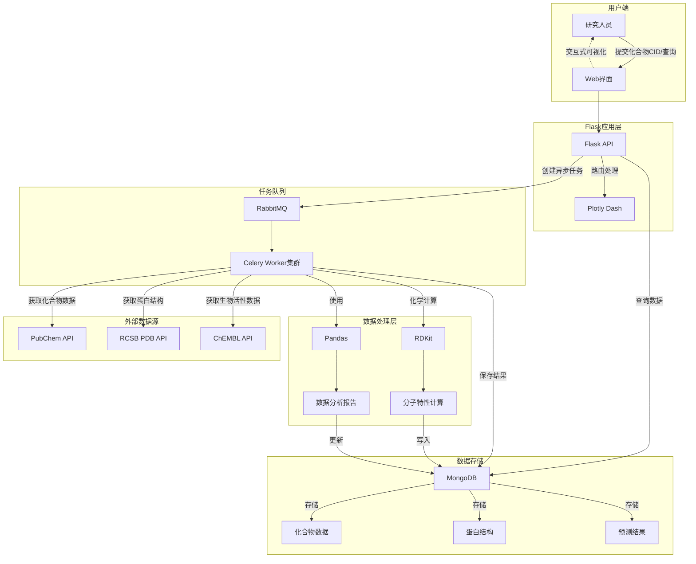

* 用户通过Web界面提交化合物查询请求
* Flask创建Celery异步任务并通过RabbitMQ分发
* Worker节点并行处理：获取外部数据→进行计算分析→保存到MongoDB
* 数据库同时支持实时查询和批量分析
* 可视化层与数据存储层直接对接展示结果

```mermaid
graph TD
    subgraph 用户端
        A[研究人员] -->|提交化合物CID/查询| B[Web界面]
        B -.->|交互式可视化| A
    end

    subgraph Flask应用层
        B --> C[Flask API]
        C -->|路由处理| D[Plotly Dash]
    end

    subgraph 任务队列
        C -->|创建异步任务| E[RabbitMQ]
        E --> F[Celery Worker集群]
    end

    subgraph 数据处理层
        F -->|使用| G[Pandas]
        F -->|化学计算| H[RDKit]
        G --> I[数据分析报告]
        H --> J[分子特性计算]
    end

    subgraph 数据存储
        K[MongoDB] -->|存储| L[化合物数据]
        K -->|存储| M[蛋白结构]
        K -->|存储| N[预测结果]
    end

    subgraph 外部数据源
        F -->|获取化合物数据| O[PubChem API]
        F -->|获取蛋白结构| P[RCSB PDB API]
        F -->|获取生物活性数据| Q[ChEMBL API]
    end

    C -->|查询数据| K
    F -->|保存结果| K
    J -->|写入| K
    I -->|更新| K
```