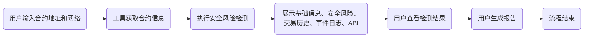

# Web3 合约检测工具产品设计文档

## 1. 产品概述

本工具旨在为用户提供一个便捷的平台，用于检测 Web3 智能合约的安全性和潜在风险。用户可以输入合约地址并选择网络，工具将分析合约的各项信息并生成报告。

## 2. 功能需求

### 2.1 核心功能

*   **合约地址输入:** 用户可以输入待检测的合约地址。
*   **网络选择:** 支持主流 Web3 网络的选择 (例如：Ethereum Mainnet, Goerli, Sepolia, Binance Smart Chain 等)。
*   **基础信息展示:**
    *   合约名称（如果可获取）
    *   合约部署者地址
    *   交易哈希
    *   区块高度
    *   首次交易时间
*   **安全风险检测:**
    *   常见漏洞检测 (重入攻击、溢出、未初始化变量等)
    *   代理合约和实现合约识别
    *   合约所有权和控制权分析
    *   外部合约调用风险评估
    *   授权和访问控制检查
*   **代码审计支持:**
    *   合约源代码查看
    *   集成静态分析工具结果 (待定)
*   **交易历史分析:**  分析合约相关的交易历史，识别异常模式。
*   **事件日志分析:**  展示合约发出的事件日志。
*   **ABI 信息展示:**  展示合约的 ABI 信息。
*   **可视化展示:**  合约结构和关系的可视化 (待定)。
*   **报告生成:**  生成包含检测结果的报告。

## 3. 用户流程

## 4. 技术方案 (待定)

## 5. 未来展望 (待定)
