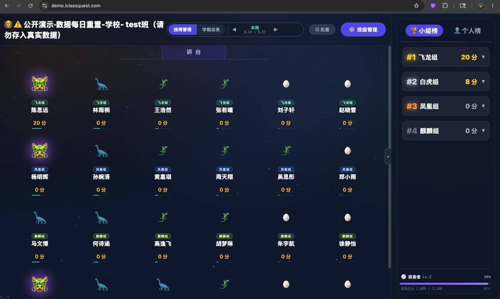
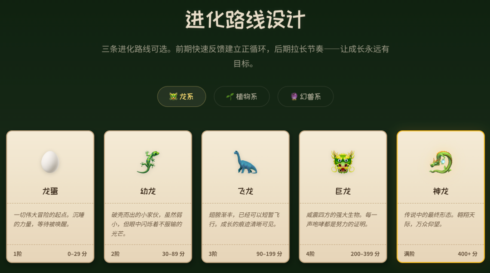
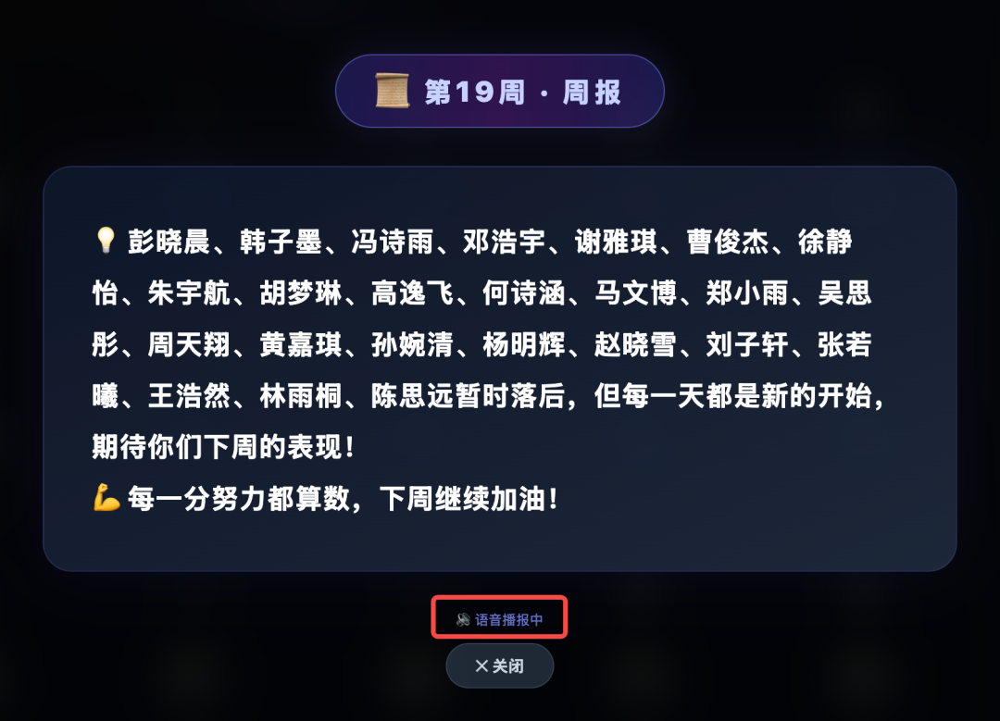

# 周末用 AI 写了个班级管理系统

## 周末用 AI 写了个班级管理系统 - iClassQuest

原创 麦地巷Soloist 麦地巷Soloist [南山独唱团](javascript:void\(0\);)

_2026年5月16日 23:36_ _广东_

在小说阅读器读本章

去阅读

在小说阅读器中沉浸阅读

当老师不容易，尤其是班主任。班主任每天要在各种群和表格中来回穿梭——统分、分析、家校沟通，只为让每个孩子的成长不被辜负。

据我观察，班主任日常的「量化分管理」工作流大概是这样的：一个纸质记分本，翻到对的页，找到对的名字，加分或扣分，每周再汇总一次，手打 Excel 周报。当然这期间有学生辅助。

看了一年后，我有点坐不住。恰逢 AI 大爆发，我决定利用周末时间做点什么——让繁琐的事情变简单，让每个孩子的努力被看见。这就是 iClassQuest 的由来。

它长什么样

简单说：教室大屏展示座位、积分和排行，也可直接点击学生进行加减分。老师用手机当遥控器也可加减分。不用走到讲台操作电脑，不用翻本子找名字。手机点两下，分数实时上屏。站着、走着、坐着都行，上课节奏完全不被打断。

教室大屏界面，可直接操作加减分

（以下演示数据是 AI 随机生成，非真实数据）

手机操作界面

手机也可同步加、减分操作

手机批量操作

但如果只是把纸质记分本搬到手机上，那也没什么意思。

让积分变得有意思

我加了一套「宠物进化」系统——每个学生都有一只专属宠物，表现越好，宠物越强。

从一颗龙蛋开始，慢慢孵化成幼龙、飞龙、巨龙，直到终极的神龙 🐉。三条进化路线可选：龙系、植物系、幻兽系。

进化到高阶的宠物会在大屏上发光，有光环特效和呼吸灯动画。进化阈值的设计借鉴了游戏设计中的「心流理论」——前期升级快，让学生快速建立成就感；后期节奏变慢，维持长期投入。不会觉得「够不到」，也不会「太容易满级没意思」。

除此之外，还有实时排行榜、分组积分、AI 周报播报（全屏动画 + AI 语音朗读，仪式感拉满）、批量打分、自定义评分规则、一键导出 Excel……基本上把班主任日常统分的场景都覆盖了。

关于 AI 辅助开发

坦率地说，这个项目大部分代码是在 AI 辅助下完成的。

我负责产品设计和架构决策，AI 负责编码执行——产品需求、交互细节、边界情况由我把控，具体代码生成交给 AI。这种「人机协作」的模式效率非常高。

整个系统从零到上线，大约花了三个周末 + 五一假期。技术栈是 Vue 3 + Node.js + SQLite + Docker，部署在腾讯云上。

这个工具一方面解决了真实痛点，另一方面也算是实践了一把 AI 在工程中的落地能力——从前端到后端到部署到运维，AI 在每个环节都深度参与。还是那句话：与其只是看别人用 AI 做了什么，不如自己下场试试。

体验一下？

系统已经在班级稳定运行了一段时间，每天使用。

如果你好奇它长什么样，我搭了一个 Demo 环境，你可以体验，需要用电脑浏览器打开。Demo 环境数据每天自动重置，请不要保存任何隐私信息：

电脑打开https://demo.iclassquest.com

手机扫码后密码是demo

这个项目的整体介绍（点击阅读原文即可访问）

https://iclassquest.com

如果有老师朋友感兴趣，可以留言：描述为什么需要这个工具，符合需求的朋友，可完全免费开通。不过毕竟是业余项目，名额有限，也没有精力提供使用承诺和服务支持——有问题的话，大概率也只能周末才能处理，还请降低预期。

Quest 有探索、寻求的意思，让我们一起探索这个有趣的世界吧。

点击 阅读原文 直达项目官网

关闭

更多

搜索「」网络结果

关闭

**

调整当前正文文字大小

**

更多

100%

​

微信扫一扫
关注该公众号

继续滑动看下一个
