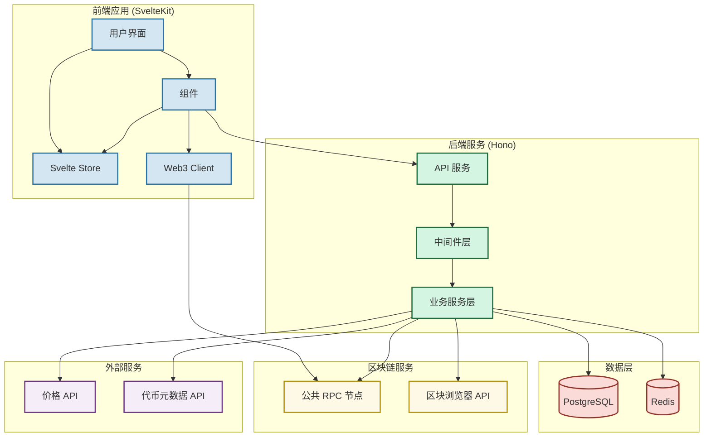
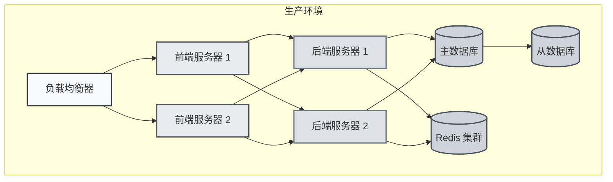

# Web3 资产管理平台技术架构图



## 架构说明

### 1. 前端层
- **用户界面 (UI)**
  - 使用 TailwindCSS + DaisyUI 构建
  - 响应式设计
  - 主题支持

- **状态管理 (Store)**
  - Svelte Store 管理应用状态
  - 钱包状态
  - 资产数据
  - 用户配置

- **组件系统 (Components)**
  - 钱包管理组件
  - 资产展示组件
  - 图表组件 (ECharts)

- **Web3 客户端**
  - ethers.js 集成
  - 多链支持
  - 钱包连接

### 2. 后端层
- **API 服务**
  - RESTful API
  - WebSocket 支持
  - 速率限制

- **中间件层**
  - 认证/授权
  - 日志记录
  - 错误处理
  - CORS

- **业务服务层**
  - 钱包管理
  - 资产追踪
  - 数据分析

### 3. 数据层
- **PostgreSQL**
  - 关系型数据存储
  - 事务支持
  - 复杂查询
  - 数据完整性

- **Redis**
  - 缓存层
  - 会话存储
  - 任务队列
  - 实时数据

### 4. 区块链服务
- **公共 RPC 节点**
  - 以太坊
  - BSC
  - Polygon

- **区块浏览器 API**
  - Etherscan
  - BscScan
  - PolygonScan

### 5. 外部服务
- **价格 API**
  - CoinGecko
  - 实时价格更新
  - 历史价格数据

- **代币元数据 API**
  - 代币信息
  - 合约 ABI
  - 代币图标

## 数据流

1. **用户操作流**
   ```
   用户界面 -> 组件 -> Store -> API -> 服务层 -> 数据库
   ```

2. **资产更新流**
   ```
   区块链服务 -> 服务层 -> Redis -> Store -> 用户界面
   ```

3. **价格更新流**
   ```
   外部服务 -> 服务层 -> Redis -> Store -> 用户界面
   ```

## 部署架构



这个架构图展示了系统的各个层次和组件之间的关系，以及数据流动的方向。图中使用不同的颜色和分组来区分不同的功能模块，使整个系统架构更加清晰。
