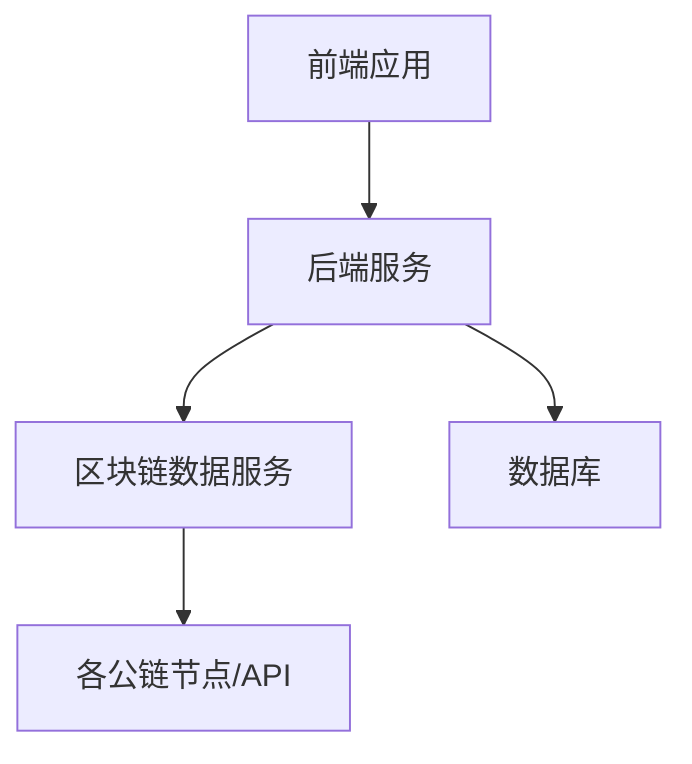
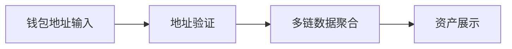

# Web3 资产管理应用架构设计

## 1. 系统架构概览



## 2. 技术栈选择

### 前端技术栈
- **框架**: SvelteKit
- **状态管理**: 内置状态管理
- **UI组件库**: TailwindCSS + DaisyUI
- **图表库**: ECharts
- **Web3交互**: ethers.js/web3.js
- **类型系统**: TypeScript

### 后端技术栈
- **框架**: Hono
- **数据库**: MongoDB
- **缓存**: Redis
- **区块链数据服务**: 
  - Moralis API
  - Covalent API
  - TheGraph

## 3. 核心功能模块

### 3.1 钱包管理模块


### 3.2 资产追踪模块
- 实时资产余额
- 代币价格追踪
- NFT 资产追踪
- DeFi 资产追踪（质押、流动性等）

### 3.3 数据分析模块
- 资产分布分析
- 历史交易记录
- 收益分析
- 风险评估

### 3.4 可视化模块
- 资产分布饼图
- 资产趋势线图
- 日收益曲线
- 链间资产对比图

## 4. 数据模型设计

### 4.1 用户模型
```typescript
interface User {
  id: string;
  walletAddresses: string[];
  createdAt: Date;
  updatedAt: Date;
}
```

### 4.2 资产记录模型
```typescript
interface AssetRecord {
  userId: string;
  walletAddress: string;
  chainId: number;
  timestamp: Date;
  assets: {
    token: string;
    amount: string;
    value: number; // USD
  }[];
  totalValue: number; // USD
}
```

### 4.3 每日汇总模型
```typescript
interface DailySummary {
  userId: string;
  date: Date;
  totalValue: number;
  chainDistribution: {
    chainId: number;
    value: number;
  }[];
  assetDistribution: {
    token: string;
    value: number;
  }[];
}
```

## 5. API 设计

### 5.1 用户相关
- POST /api/users/wallet - 添加钱包地址
- GET /api/users/assets - 获取用户资产概览
- GET /api/users/history - 获取历史资产记录

### 5.2 资产相关
- GET /api/assets/summary - 获取资产汇总
- GET /api/assets/distribution - 获取资产分布
- GET /api/assets/history - 获取历史趋势

### 5.3 分析相关
- GET /api/analytics/daily - 获取每日分析
- GET /api/analytics/chains - 获取链间对比
- GET /api/analytics/tokens - 获取代币分析

## 6. 数据更新策略

### 6.1 定时任务
- 每5分钟更新实时余额
- 每小时更新代币价格
- 每日凌晨汇总日度数据

### 6.2 缓存策略
- Redis缓存热点数据
- 用户资产数据缓存5分钟
- 历史数据缓存24小时

## 7. 安全考虑

### 7.1 数据安全
- 钱包地址加密存储
- API访问限流
- 数据备份策略

### 7.2 接口安全
- JWT认证
- API签名验证
- HTTPS传输

## 8. 扩展性考虑

### 8.1 横向扩展
- 微服务架构预留
- 数据分片策略
- 负载均衡

### 8.2 功能扩展
- 多语言支持
- 新公链集成
- 导出功能
