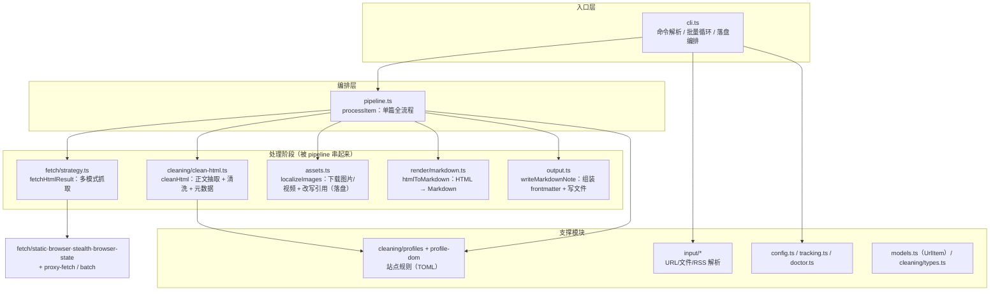
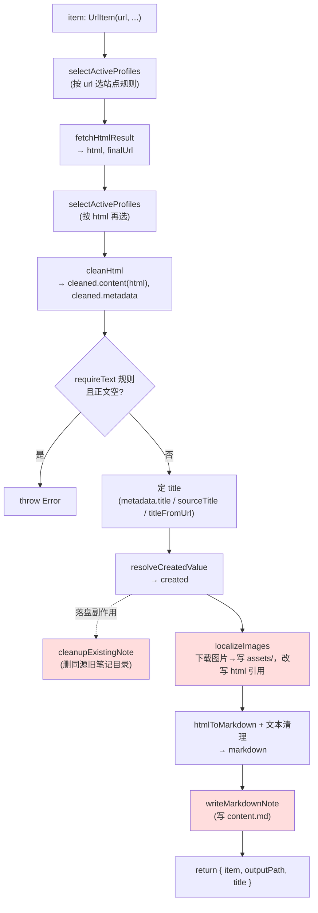
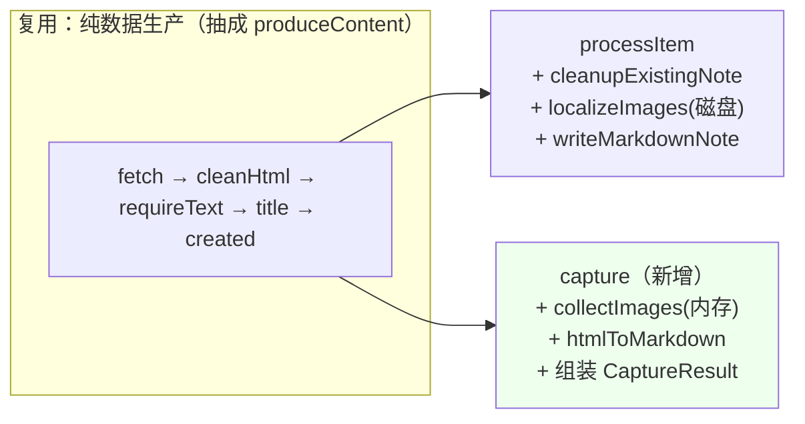

# Dino 架构与流程

> 整理日期：2026-05-31
> 目的：在为 dino 增加库入口（`import { capture } from "dino"`）之前，先理清现有代码的模块结构与数据流，作为改造依据。

## 1. 模块分层

dino 是一个 Node + TS（ESM）项目，按职责分为五层。依赖单向向下。


```mermaid
flowchart TB
    subgraph Entry["入口层"]
        CLI["cli.ts<br/>命令解析 / 批量循环 / 落盘编排"]
    end

    subgraph Pipeline["编排层"]
        PIPE["pipeline.ts<br/>processItem：单篇全流程"]
    end

    subgraph Stages["处理阶段（被 pipeline 串起来）"]
        FETCH["fetch/strategy.ts<br/>fetchHtmlResult：多模式抓取"]
        CLEAN["cleaning/clean-html.ts<br/>cleanHtml：正文抽取 + 清洗 + 元数据"]
        ASSETS["assets.ts<br/>localizeImages：下载图片/视频 + 改写引用（落盘）"]
        RENDER["render/markdown.ts<br/>htmlToMarkdown：HTML → Markdown"]
        OUTPUT["output.ts<br/>writeMarkdownNote：组装 frontmatter + 写文件"]
    end

    subgraph Support["支撑模块"]
        INPUT["input/*<br/>URL/文件/RSS 解析"]
        PROFILES["cleaning/profiles + profile-dom<br/>站点规则（TOML）"]
        CONFIG["config.ts / tracking.ts / doctor.ts"]
        MODELS["models.ts（UrlItem）/ cleaning/types.ts"]
    end

    CLI --> PIPE
    CLI --> INPUT
    CLI --> CONFIG
    PIPE --> FETCH
    PIPE --> CLEAN
    PIPE --> ASSETS
    PIPE --> RENDER
    PIPE --> OUTPUT
    CLEAN --> PROFILES
    PIPE --> PROFILES
    FETCH --> FETCHIMPL["fetch/static·browser·stealth·browser-state<br/>+ proxy-fetch / batch"]
```

### 各模块职责速查

| 文件 | 职责 | 是否纯逻辑 | 落盘副作用 |
|---|---|---|---|
| `cli.ts` | 命令/参数解析、批量循环、调用 pipeline、进度与冲突交互 | 否 | 间接 |
| `pipeline.ts` | `processItem(item, options)`：把抓取→清洗→图片→渲染→写文件串成单篇全流程 | 否 | 是（经 assets/output） |
| `fetch/strategy.ts` | `fetchHtmlResult`：按 auto/static/browser/stealth 依次尝试，返回 HTML + finalUrl | 是（可注入 fetch） | 否* |
| `cleaning/clean-html.ts` | `cleanHtml`：Defuddle 正文抽取 + 站点规则清洗 + 元数据，返回 `{content(html), metadata}` | 是 | 否 |
| `assets.ts` | `localizeImages`：遍历 img/svg/video，下载并**写入磁盘** `assets/`，改写引用为本地相对路径 | 否 | **是** |
| `render/markdown.ts` | `htmlToMarkdown`：清洗后的 HTML 转 Markdown（turndown + 修复） | 是 | 否 |
| `output.ts` | `writeMarkdownNote`：拼 frontmatter + 标题 + 正文，**写文件**；`cleanupExistingNote` 删旧 | 否 | **是** |
| `input/*` | 解析 URL / 文件列表 / RSS，产出 `UrlItem[]` | 是 | 否 |
| `cleaning/profiles*` | 加载 TOML 站点规则、匹配、应用 | 是 | 否 |

\* `fetchHtmlResult` 有一个可选的 `outputPath` 调试落盘，正常流程不传。

## 2. `processItem` 数据流（单篇全流程）

这是 pipeline 的核心，也是库 API 要复用的部分。下图标出**纯数据生产**与**落盘副作用**的边界。


```mermaid
flowchart TD
    A["item: UrlItem(url, ...)"] --> B["selectActiveProfiles<br/>(按 url 选站点规则)"]
    B --> C["fetchHtmlResult<br/>→ html, finalUrl"]
    C --> D["selectActiveProfiles<br/>(按 html 再选)"]
    D --> E["cleanHtml<br/>→ cleaned.content(html), cleaned.metadata"]
    E --> F{"requireText 规则<br/>且正文空?"}
    F -->|是| FERR["throw Error"]
    F -->|否| G["定 title<br/>(metadata.title / sourceTitle / titleFromUrl)"]
    G --> H["resolveCreatedValue<br/>→ created"]

    H -.落盘副作用.-> CLEANUP["cleanupExistingNote<br/>(删同源旧笔记目录)"]
    H --> I["localizeImages<br/>下载图片→写 assets/，改写 html 引用"]
    I --> J["htmlToMarkdown + 文本清理<br/>→ markdown"]
    J --> K["writeMarkdownNote<br/>(写 content.md)"]
    K --> R["return { item, outputPath, title }"]

    style CLEANUP fill:#fdd
    style I fill:#fdd
    style K fill:#fdd
```

红色 = 落盘副作用。其余为纯数据生产。

**关键观察：** 从 `fetchHtmlResult` 到 `htmlToMarkdown`，除了 `localizeImages` 内部的"下载图片顺便写盘"和 `cleanupExistingNote`，整条链路本质是**数据变换**。库 API `capture()` 要的就是这条链路的数据，去掉落盘。

## 3. 落盘点清单（库 API 必须绕开的）

| 落盘点 | 位置 | 库 API 如何处理 |
|---|---|---|
| `cleanupExistingNote` | pipeline.ts:123 | 不调用（删用户磁盘文件，库不该做） |
| `localizeImages` 写 `assets/` | assets.ts:80/127/176 | 改为下载到内存、返回二进制 |
| `writeMarkdownNote` 写 `content.md` | output.ts | 不调用，改为返回 markdown 字符串 |
| `fetchHtmlResult` 的 `outputPath`（调试） | strategy.ts:124 | 不传，天然跳过 |

## 4. 库 API 改造点（最小风险方案的依据）

目标：新增 `import { capture } from "dino"` 返回 `CaptureResult`（内存数据，不落盘），**不改变 `processItem`/CLI 现有行为**（59 个测试保证）。


```mermaid
flowchart LR
    subgraph 复用["复用：纯数据生产（抽成 produceContent）"]
        P["fetch → cleanHtml → requireText → title → created"]
    end

    P --> PROC["processItem<br/>+ cleanupExistingNote<br/>+ localizeImages(磁盘)<br/>+ writeMarkdownNote"]
    P --> CAP["capture（新增）<br/>+ collectImages(内存)<br/>+ htmlToMarkdown<br/>+ 组装 CaptureResult"]

    style PROC fill:#eef
    style CAP fill:#efe
```

改造三步（详见实现计划）：
1. **抽 `produceContent`**：把 `processItem` 前半段（fetch→clean→title→created，**不含** cleanupExistingNote）抽成共享函数，`processItem` 改用它。行为不变，59 测试保证。
2. **新增 `collectImages`（内存版，仅 ``）**：镜像 `localizeImages` 的 img 命名/去重逻辑，但下载到内存、返回 `{ markdown引用路径, assets:[{path,data,contentType}] }`。**不改** `localizeImages`（其 svg/video 分支测试覆盖不足，重构风险 > 收益）。重复的 img 逻辑用注释标注为待提取技术债。
3. **新增 `capture()` + `package.json` exports**：组装 `CaptureResult`，CLI `bin` 不动。

### 已知约束（基于实测）
- dino 现有 `localizeImages` 仅 3 个测试，**未覆盖** svg / video / mjx 分支 → 不重构它。
- v1 `capture()` 只收集 ``；svg/video 在 markdown 中保留原样（不阻塞文章导入）。
- `capture()` 失败即 throw；只处理单篇（批量/RSS 留 CLI 层）。
- 返回的图片 `data` 为 `Uint8Array`（运行时可能是 Buffer）。

### CaptureResult 契约（与 amber 的 RawCapture 对齐）
```ts
interface CaptureResult {
  url: string;          // 最终 URL（重定向后）
  title: string;
  markdown: string;     // 图片引用为 assets 项的 path，如 
  author?: string;
  publishedAt?: string; // ISO 8601，可能没有
  assets: CaptureAsset[];
}
interface CaptureAsset {
  path: string;         // markdown 中的引用路径，如 "assets/image-001.png"
  data: Uint8Array;
  contentType?: string;
}
interface CaptureOptions {
  fetchMode?: "auto" | "static" | "browser" | "stealth"; // 默认 auto
}
```
